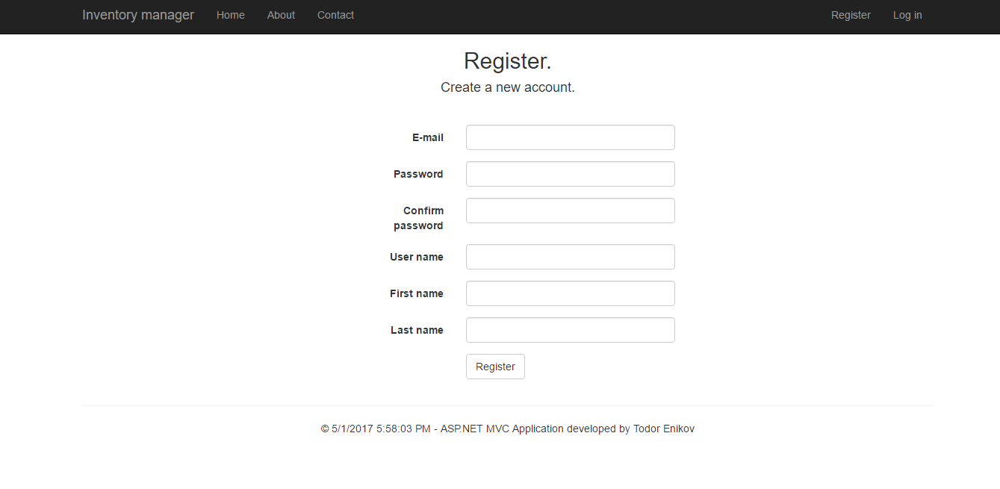

# InventoryManager-ASP.NET-MVC-Project
The inventory management store application allows Store managers to manage (create, read, update and delete) clothes for their stores.

### Project desctiption:
#### ASP.NET MVC Inventory manager application.
This is application made on ASP .NET MVC.
It's purpose is to create clothes by user with role Administrator.
The application has administration panel and only user with role "Administrator", can create clothes, edit clothes information, delete clothes, edit information of given user, change role of given user.

Roles in the application and what can they visit.
* Administrator - can visit all pages in the application.
* Regular user - can visit home, about, contact, profile, all clothes, all users and details for user and clothes pages.
* Not registered user - can see only home, about, contact, login, register, view all clothes and details for clothes pages.

### Images from the application:

## GitHub repository:

https://github.com/todor-enikov/InventoryManager-ASP.NET-MVC-Project
